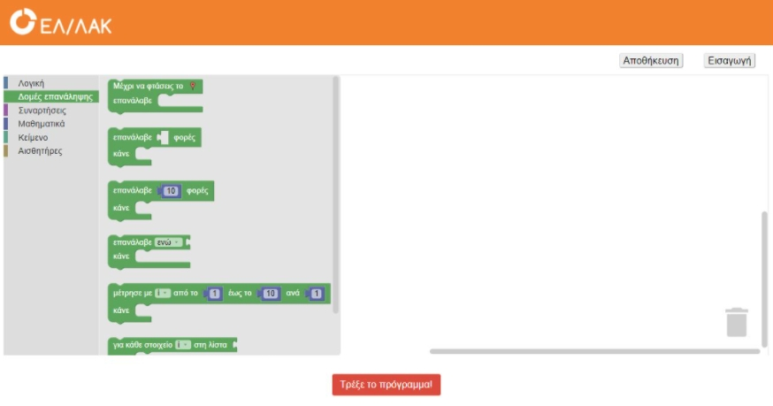

 
## Σχετικα μέ το FOSSbot

Εκπαιδευτικό ρομπότ για το Νηπιαγωγείο και το Δημοτικό. 

Επέκταση του "GSOC 2019 - A DIY robot kit for educators.

## Διαθέσιμοι αισθητήρες

* Ultrasonic distance sensor
* Battery Sensor
* Accelerometer
* Gyroscope
* Odometers
* IR Receiver
* Line detection sensors
* Light Sensors

## Ειδικά χαρακτηριστικά

* Lego compatible surface
* Hole in front for marker/ pencil attachment
* Special pulling loop
* Rechargeable batteries 	
* Speaker
* Front RGB LED

## Προγραμματιστικό περιβάλλον

## Ομάδα Ανάπτυξης Υλικού/Λογισμικού

* Ηρακλής Βαρλάμης
* Χρήστος Χρόνης
* Θανάσης Αποστολίδης
* Ελευθερία Παπαγεωργίου